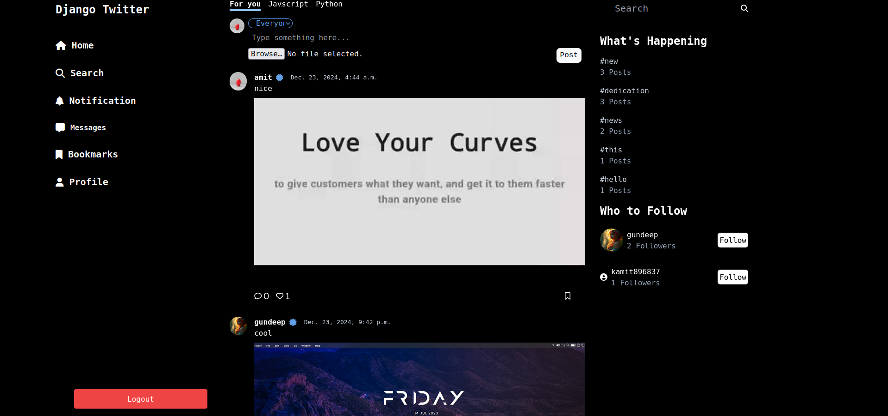
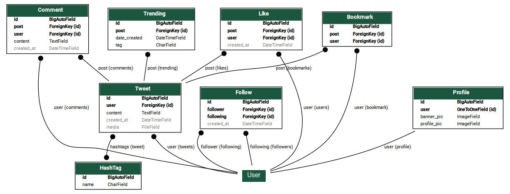

# Twitter Clone with Django and Allauth




This project demonstrates a basic Twitter clone built using Django and enhanced with features like Google login and social media interactions.

**Key Features:**

* **User Authentication:**
    * User registration and login
    * Google login integration using Django Allauth
* **Tweet Functionality:**
    * Create, read, update, and delete tweets
    * Post images with tweets
    * Follow/Unfollow other users
* **Social Interactions:**
    * Like and unlike tweets
    * Comment on tweets
    * Reply to tweets
* **Hashtags:**
    * Add hashtags to tweets
    * View tweets associated with a specific hashtag
    * Display trending hashtags

**Project Structure:**

```
.
|-- app
|   |-- admin.py
|   |-- apps.py
|   |-- forms.py
|   |-- models.py
|   |-- tests.py
|   |-- urls.py
|   |-- views.py
|-- db.sqlite3
|-- diagram.png
|-- manage.py
|-- media
|   |-- banner
|   |   |-- Add_a_heading.png
|   |-- tweets
|   |   |-- media
|   |       |-- app_G9sTM82.mp4
|   `-- users
|       |-- annie-spratt-m1t-RJ1iCIU-unsplash.jpg
|-- README.md
|-- requirements.txt
|-- static
|   |-- gamer.png
|   |-- src
|       |-- input.css
|       |-- output.css
|-- tailwind.config.js
|-- templates
|   |-- 404.html
|   |-- account
|   |   |-- google
|   |   |-- google_login.html
|   |   |-- login.html
|   |   |-- logout.html
|   |   |-- password_reset.html
|   |   `-- signup.html
|   |-- _base.html
|   |-- bookmark.html
|   |-- comment.html
|   |-- edit.html
|   |-- hashtags.html
|   |-- index.html
|   |-- profile_edit.html
|   |-- profile.html
|   |-- profile_images.html
|   |-- profile_videos.html
|   |-- search.html
|   |-- socialaccount
|   |   `-- login.html
|   |-- user.html
|-- tree_structure.txt
|-- tweets
|   |-- media
|       |-- Screenshot_20230807_145652.png
`-- twitter
    |-- asgi.py
    |-- settings.py
    |-- urls.py
    |-- wsgi.py


```

**Installation:**

1. **Create a virtual environment:**
   ```bash
   python3 -m venv venv
   source venv/bin/activate 
   ```

2. **Install dependencies:**
   ```bash
   pip install -r requirements.txt
   ```

3. **Configure Django:**
    * **Create a database:** Follow Django's database configuration instructions in `settings.py`.
    * **Configure Google OAuth:**
        * Register your application with Google Cloud Console.
        * Obtain Client ID and Client Secret.
        * Update `settings.py` with your Google OAuth credentials.
    * **Configure Django Allauth:**
        * Update `settings.py` with the desired authentication providers.
        * Create superuser: `python manage.py createsuperuser`

4. **Run migrations:**
   ```bash
   python manage.py migrate
   ```

5. **Collect static files:**
   ```bash
   python manage.py collectstatic
   ```

6. **Run the development server:**
   ```bash
   python manage.py runserver
   ```

**Database Relationship**


**Usage:**

* Access the application in your web browser.
* Explore the user interface for creating tweets, interacting with other users, and exploring hashtags.

**Development Notes:**

* Consider using a CSS framework like Bootstrap or Tailwind CSS for styling.
* Implement pagination for better user experience.
* Add real-time updates using WebSockets or a similar technology.
* Enhance security measures, such as input validation and CSRF protection.
* Consider using a cloud platform like Heroku or AWS for deployment.

**Contributing:**

Contributions are welcome! Please submit a pull request with clear documentation.
